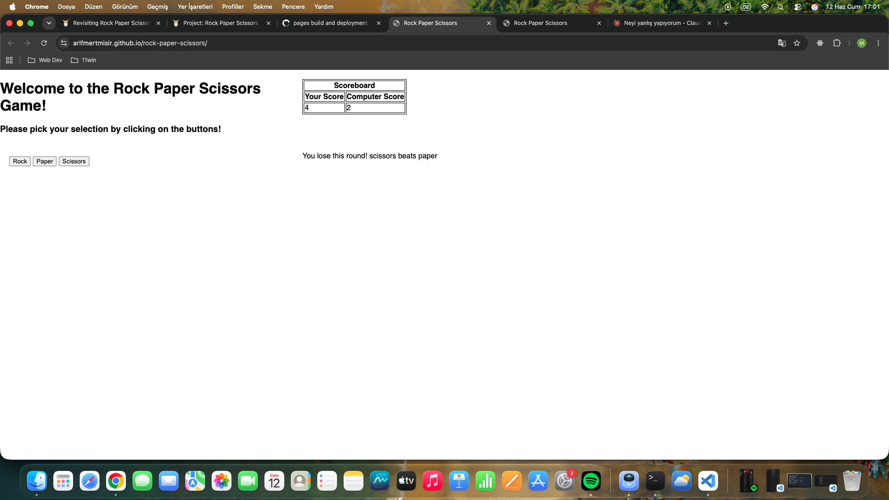

JS Project

# Rock Paper Scissors

A console-based Rock Paper Scissors game built with vanilla JavaScript as part of [The Odin Project](https://www.theodinproject.com/lessons/foundations-rock-paper-scissors) Foundations curriculum.

## 📋 Assignment Requirements

### Step 1: Project Structure

- [x] Created a new Git repository
- [x] Created a blank HTML document with an external JavaScript file linked via script tag

### Step 2: Computer Choice Logic

- [x] Created a `getComputerChoice` function that randomly returns `"rock"`, `"paper"` or `"scissors"`

### Step 3: Human Choice Logic

- [x] Created a `getHumanChoice` function that returns the user's input via `prompt`

### Step 4: Score Variables

- [x] Declared `humanScore` and `computerScore` in the global scope, initialized to `0`

### Step 5: Single Round Logic

- [x] Created a `playRound(humanChoice, computerChoice)` function
- [x] `humanChoice` is case-insensitive (e.g. "ROCK", "RocK" all work)
- [x] Logs the round result (e.g. `"You lose! Paper beats Rock"`)
- [x] Increments the correct score variable based on the round winner

### Step 6: Full Game Logic

- [x] Created a `playGame` function
- [x] Plays 5 rounds by calling `playRound` 5 times using a loop
- [x] Declares the overall winner at the end

### Step 7: UI Refactor

- [x] Replaced `prompt`-based input with clickable buttons
- [x] Removed the 5-round loop logic
- [x] Added DOM methods to display results instead of `console.log`
- [x] Display live running score
- [x] Announce a winner when a player reaches 5 points

## 🎮 How to Play

1. Open `index.html` in your browser
2. Click Rock, Paper, or Scissors to play a round
3. First to 5 points wins the game!

## 🖥️ Console Output

## 🛠️ Built With

- HTML
- CSS
- JavaScript (Vanilla)
